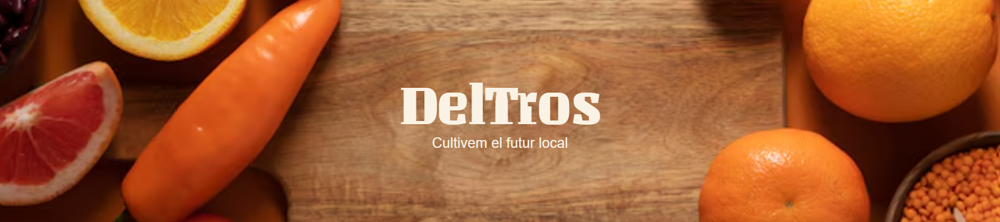
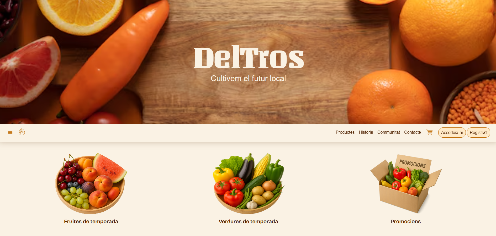
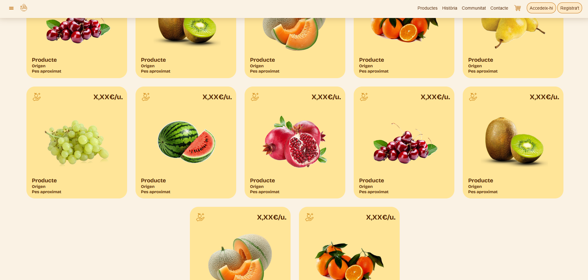
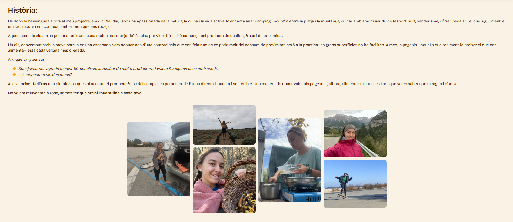
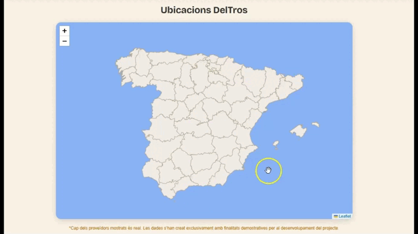

**DelTros** es un proyecto web desarrollado desde cero con el objetivo de aplicar de forma práctica mis conocimientos en diseño, estructura y desarrollo front-end.  

A través de este proyecto, he trabajado en la *construcción de una identidad digital coherente*, cuidando tanto la estética visual como la organización técnica del código. La propuesta combina *diseño funcional, navegación intuitiva* y una *comunicación visual consistente*, reflejando mi capacidad para transformar una idea conceptual en un producto digital completo.  

Además, sirve como espacio de experimentación para seguir incorporando nuevas tecnologías y mejorar la escalabilidad del proyecto a futuro.

---

## 🌱 Descripción del proyecto

DelTros es una página web diseñada con **HTML y CSS** que busca transmitir la esencia de la producción local, el respeto por el entorno y la conexión con la naturaleza.  
El sitio está estructurado en distintas secciones que reflejan los valores del proyecto:

- **Home** — Página principal con cabecera e introducción.  
- **Productes** — Catálogo de productos locales (en desarrollo).
- **Història** — Espacio visual donde se narra la filosofía y el recorrido de DelTros.  
- **Comunitat** — Sección dedicada a la colaboración y participación local (en desarrollo).  
- **Contacte** — Página de contacto y comunicación (en desarrollo).  
- **Carro** — Página de compra (en desarrollo).

---

## 🎨 Diseño y características

- Estructura semántica en **HTML5**.  
- Estilos desarrollados en **CSS3** con un enfoque **responsive**.  
- Uso de **grid y flexbox** para adaptar los elementos al tamaño de pantalla.  
- **Tipografías personalizadas** desde Google Fonts:
  - [Unlock](https://fonts.google.com/specimen/Unlock)
  - [Bricolage Grotesque](https://fonts.google.com/specimen/Bricolage+Grotesque)
- Navegación intuitiva con una barra superior fija.
- Pie de página con enlaces a redes sociales e información adicional.

---

## 🧭 Estructura del repositorio

📂 **DelTros/**
- 🖼️ **1-DCIM/** → Recursos visuales (imágenes, iconos, tipografía)
- 🔤 **2-Tipografia/** → Fuentes utilizadas
- 💻 **3-Codigo/** → Archivos HTML y CSS organizados por secciones:
  - 🏠 **a-Home/**
  - 🍊 **b-Products/**
  - 🌿 **c-Story/**
  - 🗺️ **d-Maps/**
  - 🛒 **e-Purchase-dropdown/**
  - 🧃 **f-Products-dropdown/**
  - 👥 **g-Community/**
  - ✉️ **h-Contact/**
- 🏁 **index.html** → Página principal para GitHub Pages

---

## 🚀 Publicación en GitHub Pages

El sitio está alojado en GitHub Pages:  
👉 [https://claudiatrigo.github.io/DelTros/](https://claudiatrigo.github.io/DelTros/)

---

## 💡 Próximos pasos

- [ ] Completar las distintas secciones del sitio y optimizar la estructura del código mediante componentes reutilizables.  
- [ ] Preparar el proyecto para su escalabilidad futura, migrándolo a un framework moderno como **Angular**. 
- [ ] Añadir interactividad con **JavaScript** para mejorar la experiencia del usuario.  
- [ ] Mejorar la **accesibilidad**, el **rendimiento** y la **usabilidad** general del sitio.  

---

## 👩‍💻 Autora

Desarrollado por **Claudia Trigo**    
📍 Proyecto personal en desarrollo — 2025.

---

## 📸 Capturas del proyecto

